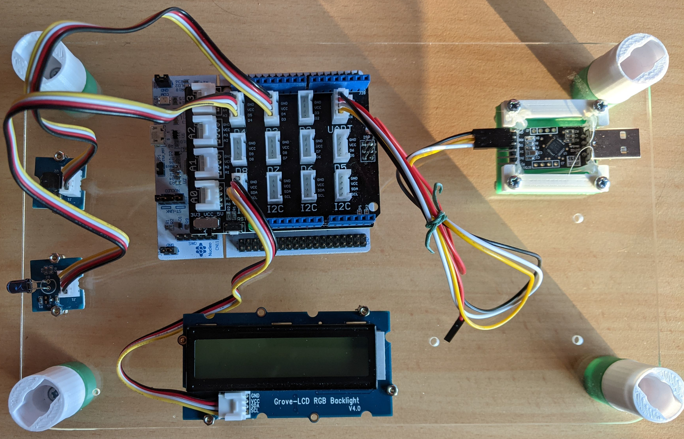
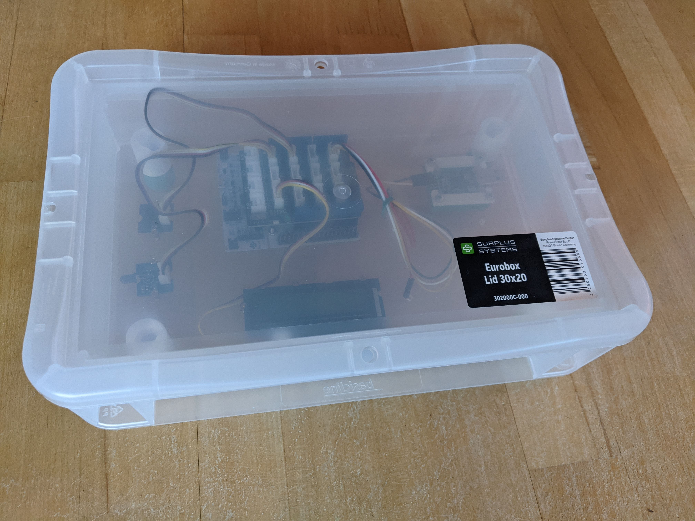

# Hardware

## Requirements

1. No electronic design. no PCB design, no manufacturing including soldering
   shall be required
2. The Hardwaresetup shall be fixed, transportable and easy to bring up.
3. It should possible to disassemble the whole hardware without destroying the
   components.

## Solution

* Use a MCU COTS board with Arduino pin connectors.
* Use Grove/Seeed shield to plug in peripherals

As MCU hardware STM nucleo board are picked because they are broadly used and
there is excelent hal support for allmost all of them. 

What we need is 

* A timer with ISR and an input pin for reading infrared telegrams
* A timer with ISR and a pwm with output pin for writing telegrams
* An uart to allow communication from remote
* An optional display that shows arbitrary information like software
  version/variant, activity status

Nothing special, any Nucleo eval buard will do. Since a Nucleo-stm32G071RB is a
already available by chance, we go for that.

## BOM

| No | Units | Description/Reference                                                            |
|---:|------:|----------------------------------------------------------------------------------|
| 1  |    1x | [Nucleo-STM32G071RB](https://www.st.com/en/evaluation-tools/nucleo-g071rb.html)  |
| 2  |    1x | [Grove Baseshield V2](https://wiki.seeedstudio.com/Base_Shield_V2/)              |
| 3  |    1x | [Grove Infrared receiver](https://wiki.seeedstudio.com/Grove-Infrared_Receiver/) |
| 4  |    1x | [Grove Infrared emitter](https://wiki.seeedstudio.com/Grove-Infrared_Emitter/)   |
| 5  |    1x | [Grove LCD RGB Backlight](https://wiki.seeedstudio.com/Grove-LCD_RGB_Backlight/) |

## Mechanical Fixing

Stackable base plate with holes, and assembled parts

You can detect:

* middle: Nucleo board with hocked up grove base shield
* left side top: Infrared Reciever
* left side button: Infrared Emitter
* button: 16x2 LCD display
* right side: UART to USB (CP2103) converter for convenience

Fits into an Euro Box 20cm x 30 cm x 7.5 cm for dust free storage

 

