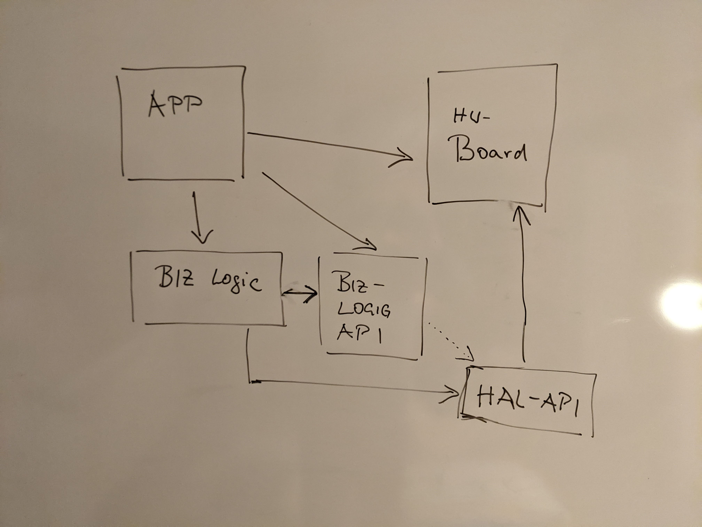

# Software

## Reference Architecture

Simple (RTOS free) embedded iot devices can use a reference architecture like

 ### APP

* The application the embedded device is running
* Unit that implements top level of control and behavior
* One application runs at a time
* An application requires certain hardware resource available

### Board

* Maps the hardware resources provided by the board into the software
* Implements [Embedded HAL Interface](#embedded-hal-interface) for the specific board resources

### Embedded HAL Interface

* General hardware abstraction for common types of peripherals
* like GPIO input, output, I2C, SPI, UART,  ADC, DAC, CAN, timer
* Is same for all processor architectures and boards

### Biz Logic Component

* Provides an certain well-specified business logic
* encapsulated into a reusable component
* It has no dependencies to hardware/board since it is independent upon any specific hardware
* It might require certain hardware, to work with using the 
  [Embedded HAL Interface](#embedded-hal-interface) interface exclusively
  Thus, there is a dependency to the interface, but not to the board
* Business Logic Components might implement some business hardware communication protocol
  of a chip connected via a standard HAL peripheral, it could be called a driver

## Instanced Reference Architecture in Rust

[Draft]
### Processor Arch specifics
- target command set
- Interrupt vector priority/ ISR handling (pending)
- critical sections

### No OS specifics

* panic handler
* logging
  
### Peripherals

MCU Vendor (SVD file) -> xyz-hal crate [embedded-hal](https://crates.io/crates/embedded-hal) dependency

Board

Depending on the requirements to the IOT device 
## Rust environment for embedded

* embedded book
* defmt for logging

### Async processing/ async await

* https://crates.io/crates/nb

## Hardware binding

* embedded hal
* memory protection -- ownership, borrowing

## General Model
